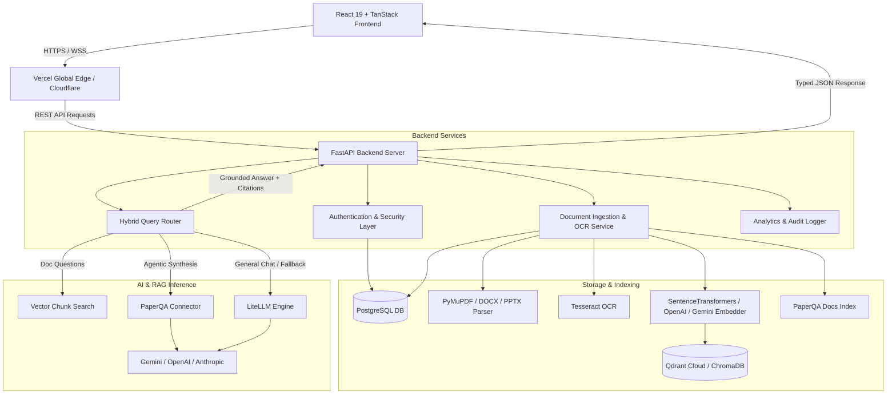

# 🏛️ SS SPARK — System Architecture & Design

This document details the architectural blueprint, data flow pipelines, security boundaries, and storage models for **SS SPARK** (AI Question Paper Analyzer).

---

## 1. High-Level Architecture



---

## 2. End-to-End Application Flow

### A. Document Upload & Ingestion Flow
```text
User Uploads File (PDF / DOCX / PPTX / Image / TXT)
  │
  ▼
FastAPI /api/upload
  ├── Validate file type whitelist & max size (50MB)
  ├── Save file with randomized prefix: {doc_id[:8]}_{filename}
  ├── Extract Text & Pages:
  │     ├── PDF ──────► PyMuPDF (fitz) page-by-page extraction
  │     ├── DOCX/PPTX ─► python-docx / python-pptx structured text
  │     └── Images ───► Tesseract OCR with image preprocessing
  ├── Chunk text with recursive token splitter (chunk_size=500, overlap=50)
  ├── Generate dense embeddings (384-dim / 1536-dim)
  ├── Index into Vector Store (Qdrant payload / ChromaDB metadata):
  │     payload: { doc_id, user_id, source_name, page, text }
  ├── Index into PaperQA Docs Collection (Docs.aadd)
  └── Save UploadedDoc metadata to MongoDB
```

### B. Hybrid RAG & Query Routing Flow
```text
User Sends Message (Query + Session ID)
  │
  ▼
FastAPI /api/chat
  ├── 1. Load multi-turn conversation memory (last 16 messages from MongoDB)
  ├── 2. Save user message to MongoDB
  ├── 3. Document Check: Are any documents indexed?
  │      │
  │      ├── [NO DOCS] ──► General Conversational LLM (LiteLLM)
  │      │                   (Formatted Markdown answer, 0 fake citations)
  │      │
  │      └── [DOCS EXIST] ──► LLM Intent Classifier (is_question_relevant_to_docs)
  │                             │
  │                             ├── [UNRELATED] ─► General LLM with full chat context
  │                             │
  │                             └── [RELATED] ───► Hybrid RAG Pipeline:
  │                                                  ├── Contextualize follow-up query
  │                                                  ├── Vector search in Qdrant (filtered by user_id)
  │                                                  ├── Execute PaperQA agentic query
  │                                                  └── If PaperQA is unsure, synthesize directly
  │                                                      from retrieved top-k vector chunks
  ├── 4. Standardize response payload with citations [{id, source, page, snippet, relevance}]
  ├── 5. Save assistant message & update chat session in MongoDB
  └── 6. Return response to frontend
```

---

## 3. Data Isolation & Security Architecture

### Strict Multi-Tenant Isolation
All database collections and vector payloads are partitioned by `user_id`:
- **Document Metadata**: Queries enforce `{"user_id": current_user.id}`.
- **Chat History & Sessions**: Messages and sessions are scoped strictly to the session owner.
- **Vector Search**: Qdrant search applies a mandatory `FieldCondition(key="user_id", match=MatchValue(value=user_id))` filter. Users can never retrieve another user's vector embeddings.

### Authentication & Token Flow
- **Access Tokens**: JWT signed with `HS256`, 60-minute TTL.
- **Refresh Tokens**: Cryptographically secure random tokens stored with 30-day expiry.
- **Password Security**: Bcrypt with SHA-256 pre-hashing (eliminates bcrypt's 72-byte truncation limitation and defends against long-password DoS).
- **Security Headers**: Standard `nosniff`, `DENY` framing, `strict-origin-when-cross-origin`, and restricted permissions policies on all responses.

---

## 4. Database Schema (MongoDB)

| Collection | Key Fields | Indexes |
| :--- | :--- | :--- |
| `users` | `id`, `email`, `hashed_password`, `full_name`, `role`, `status`, `created_at` | `email` (unique), `username` (unique, sparse) |
| `documents` | `id`, `name`, `kind`, `size_mb`, `pages`, `chunk_count`, `file_path`, `user_id`, `uploaded_at` | `(user_id, uploaded_at DESC)`, `id` (unique) |
| `chat_sessions` | `id`, `user_id`, `title`, `pinned`, `archived`, `message_count`, `updated_at` | `(user_id, updated_at DESC)`, `id` (unique) |
| `chat_messages` | `id`, `session_id`, `user_id`, `role`, `content`, `confidence`, `citations`, `created_at` | `(session_id, created_at ASC)`, `(user_id, created_at DESC)` |
| `audit_logs` | `id`, `user_id`, `action`, `ip_address`, `user_agent`, `created_at` | `(user_id, created_at DESC)`, `created_at` (90-day TTL) |
| `notifications` | `id`, `user_id`, `title`, `message`, `read`, `created_at` | `(user_id, created_at DESC)` |
| `system_settings`| `id`, `llm_model`, `embedding_model`, `chunk_size`, `chunk_overlap`, `allowed_file_types` | `id` (unique) |
